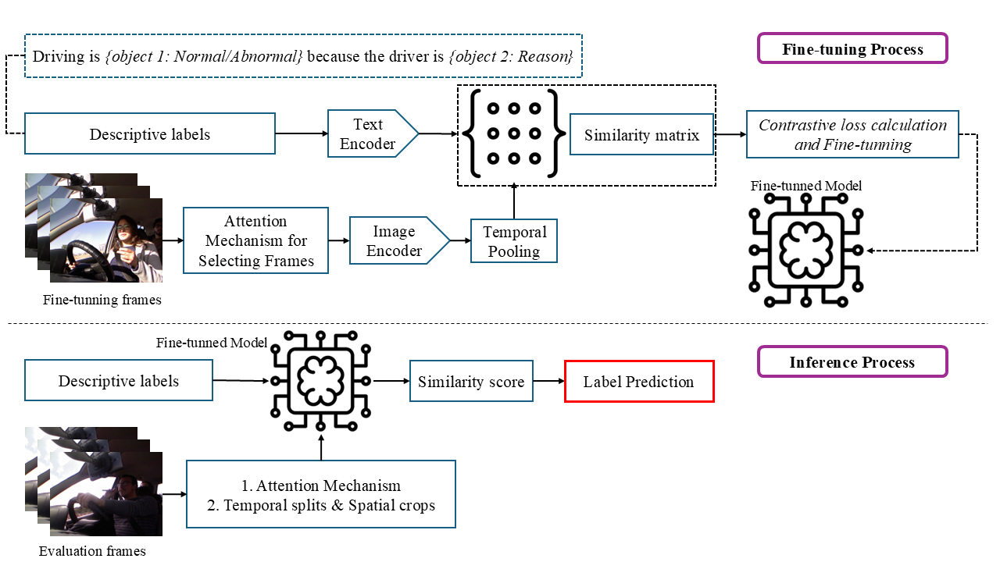
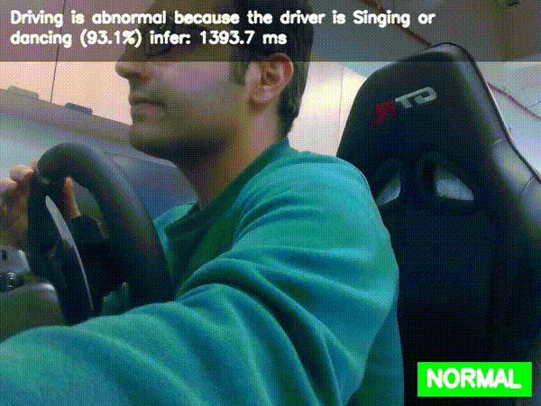

# Vigi-CLIP: Driver Vigilance Monitoring using Vision-Language Models

A CLIP-based framework for recognizing driver vigilance and distraction by aligning video frames with descriptive text using attention-guided frame selection.

## Framework Overview

## Demo

## Description

Vigi-CLIP is a vision-language framework for driver vigilance monitoring.

The model leverages CLIP to align visual driver behavior with descriptive text labels, enabling interpretable and robust recognition of normal and abnormal driving activities.

Key ideas:

- Attention-guided frame selection to focus on informative video frames
- Contrastive learning to align video features with text descriptions
- Temporal pooling for video-level understanding
- Two inference strategies:
  - Attention-based frame selection
  - Temporal splitting and spatial cropping

This approach improves both performance and interpretability for driver monitoring systems.

## Results

- 90.12% accuracy on 3MDAD dataset (video-level)
- 91.67% accuracy on EBDD dataset
- Outperforms existing CLIP-based and CNN-based methods

## Why Vigi-CLIP?

- Uses vision-language alignment for better reasoning
- Focuses only on important frames (efficient)
- Provides interpretable predictions via text similarity
- Works on both images and videos
- Strong generalization across datasets
